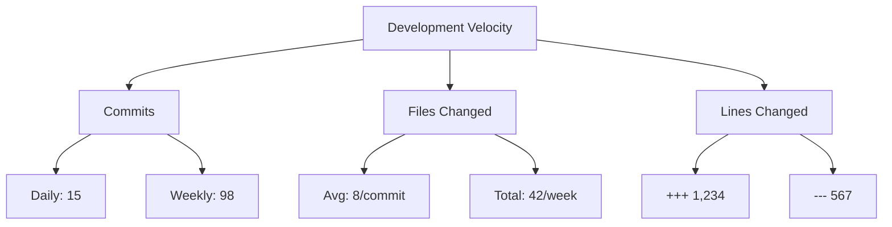
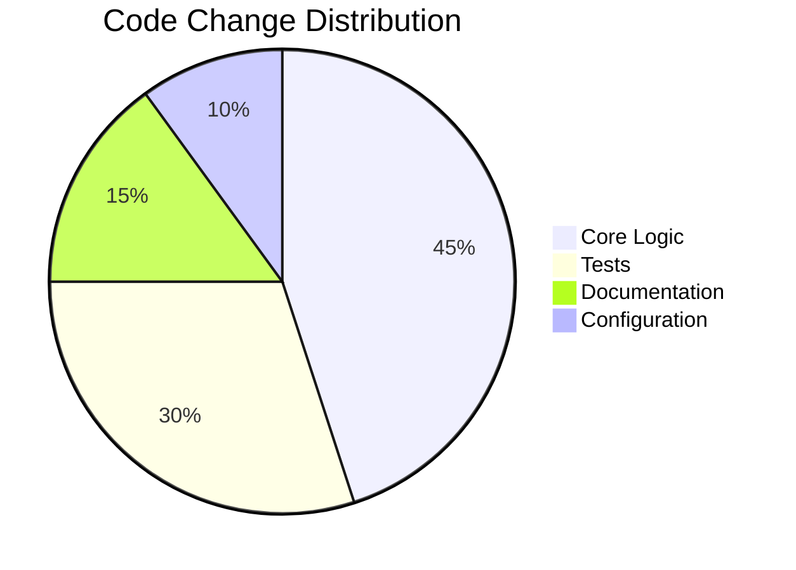

# Analytics Dashboard

## Overview
The Analytics Dashboard provides comprehensive insights into development activity, team productivity, and code quality metrics for Beacon - your delivery compass for empowered product builders.

## Metric Interpretation Guide

### Key Metrics Explained
| Metric | Description | Ideal Range | Interpretation |
|--------|-------------|-------------|---------------|
| **Commit Frequency** | Number of commits over time | 3-10/day/developer | Higher = active development; Lower = possible blockers |
| **Files Changed** | Total files modified | Varies by project | High numbers may indicate large features or refactoring |
| **Lines Added/Deleted** | Code volume changes | Balanced ratio | High additions = new features; High deletions = cleanup |
| **Net Change** | (Lines added) - (Lines deleted) | Positive growth | Negative may indicate tech debt reduction |
| **Component Impact** | Files by component type | Balanced distribution | High core changes = foundational work; High test changes = quality focus |

### Health Indicators
- 🟢 **Balanced Metrics**: Similar ratios of additions/deletions across components
- 🟡 **Warning Signs**: High deletions without tests, frequent config changes
- 🔴 **Critical Issues**: Core changes without tests, documentation ratio < 5%

## Sample Dashboards

### Development Velocity Dashboard


**Interpretation**:  
Healthy velocity with consistent commit activity. Net positive change indicates feature development outweighing cleanup.

### Code Health Dashboard


**Interpretation**:  
Well-balanced distribution with significant test coverage. Ideal ratio is 3:1 code-to-tests.

### Team Performance Dashboard
```mermaid
barChart
    title Team Contributions
    xAxis Days
    yAxis Commits
    series Team A
    series Team B
    data  Mon [5, 7]
    data  Tue [8, 4]
    data  Wed [6, 9]
    data  Thu [7, 6]
    data  Fri [4, 8]
```

**Interpretation**:  
Balanced contributions across teams. Wednesday/Friday show complementary productivity patterns.

## Visualization Examples

### Trend Analysis
```
Commit Frequency (Last 30 Days)
  ^
10|       o       o
  |      / \     / \
 5|-----/---\---/---\-----
  |   /     \ /     \
 0+---------------------->
   1   5   10   15   20   25   30
```

**Interpretation**:  
Peaks indicate sprint activity, valleys may represent code review/planning days.

### Hotspot Identification
```
Frequently Changed Files (Last Quarter)
src/analytics.py  : ███████████████████ 19 changes
tests/test_utils.py: ████████████ 12 changes
config/settings.py: ███████ 7 changes
```

**Interpretation**:  
Analytics module is evolving rapidly - ensure adequate test coverage.

## Key Metrics Tracked

### Development Velocity
- **Commits per Day/Week**: Track development activity frequency  
  *Healthy: Consistent daily commits, not clustered*
- **Lines of Code**: Insertions and deletions over time  
  *Healthy: Balanced additions/deletions (1.5:1 ratio)*
- **Files Modified**: Scope of changes per commit  
  *Healthy: 3-8 files/commit for medium projects*
- **Feature Completion Rate**: Story points delivered per sprint  
  *Healthy: 80-120% of planned capacity*

### Code Quality Indicators
- **Test Coverage**: Percentage and trend analysis  
  *Healthy: >80% coverage, increasing trend*
- **Component Impact**: High/medium/low impact file changes  
  *Healthy: <20% high-impact changes without tests*
- **Technical Debt**: Refactoring vs. feature development ratio  
  *Healthy: 20-30% refactoring effort*
- **Documentation Updates**: Docs changes per feature  
  *Healthy: 1 doc update per 3 features*

### Team Productivity
- **Individual Contributions**: Commit frequency and code ownership  
  *Healthy: Balanced distribution, no single points of failure*
- **Collaboration Patterns**: Cross-component contributions  
  *Healthy: 30-50% cross-team contributions*
- **Review Participation**: Code review engagement  
  *Healthy: All team members participate in reviews*
- **Knowledge Sharing**: Mentoring and pair programming activity  
  *Healthy: 5-10% of commits from pairing sessions*

## Analytics Tools

### Bash Script (`commit-analytics.sh`)
**Purpose**: Quick commit analysis with colored output  
**Features**:
- Standard and extended output formats
- File type and component breakdown
- Branch and author filtering
- JSON output for automation

**Usage Examples**:
```bash
# Basic usage
./docs/scripts/commit-analytics.sh

# Detailed analysis
./docs/scripts/commit-analytics.sh -d -f extended

# Analyze specific branch
./docs/scripts/commit-analytics.sh -b feature/new-indicators

# JSON output for CI/CD
./docs/scripts/commit-analytics.sh -f json
```

### Python Reporter (`analytics_reporter.py`)
**Purpose**: Advanced analytics and range analysis  
**Features**:
- Single commit detailed analysis
- Range analysis (weekly, monthly)
- Impact assessment
- Team contribution summaries

**Usage Examples**:
```bash
# Analyze latest commit
python docs/scripts/analytics_reporter.py

# Weekly team report
python docs/scripts/analytics_reporter.py --range --since "1 week ago"

# Custom date range
python docs/scripts/analytics_reporter.py --range --since "2024-01-01" --until "2024-01-31"

# JSON output for dashboards
python docs/scripts/analytics_reporter.py --format json --range
```

## Dashboard Implementation Guide

### Grafana Setup
1. Install Grafana and Prometheus
2. Configure Prometheus data source
3. Import dashboard template:
```json
{
  "dashboard": {
    "title": "Beacon Analytics",
    "panels": [
      {
        "title": "Commit Frequency",
        "type": "graph",
        "targets": [{
          "expr": "sum(beaconled_commits_total[1d])"
        }]
      }
    ]
  }
}
```

### Custom Metrics Collection
```python
# prometheus-exporter.py
from prometheus_client import start_http_server, Counter, Gauge
import time
from beaconled.core.analyzer import GitAnalyzer

commits = Counter('beacon_commits', 'Total commits analyzed')
changed_files = Gauge('beacon_files_changed', 'Files changed in analysis period')

def collect_metrics():
    analyzer = GitAnalyzer()
    stats = analyzer.get_range_analytics("1 day ago")
    commits.inc(stats.total_commits)
    changed_files.set(stats.total_files_changed)

if __name__ == '__main__':
    start_http_server(8000)
    while True:
        collect_metrics()
        time.sleep(3600)  # Collect hourly
```

## Best Practices for Analysis

### For Product Managers
1. **Velocity Trends**: Look for consistent weekly patterns
2. **Feature Focus**: Component distribution shows priority areas
3. **Risk Assessment**: High-impact changes need verification
4. **Team Capacity**: Contributor distribution indicates bandwidth

### For Engineering Managers
1. **Burnout Prevention**: Watch for individual contributor spikes
2. **Knowledge Gaps**: Identify components with single owners
3. **Quality Gates**: Require tests for high-impact changes
4. **Tech Debt**: Monitor refactoring ratio

### For Developers
1. **Impact Awareness**: Understand change significance
2. **Collaboration**: Use pairing stats to find pairing opportunities
3. **Quality Focus**: Maintain test coverage above 80%
4. **Documentation**: Keep docs ratio above 5% of changes

## Troubleshooting

### Data Discrepancies
1. **Missing Commits**: Check date ranges and repository path
2. **Inconsistent Counts**: Verify git history depth
3. **Permission Issues**: Ensure access to repository
4. **Version Mismatch**: Update Beacon to latest version

### Visualization Issues
1. **Broken Charts**: Check data source connections
2. **Incorrect Scales**: Verify timezone settings
3. **Missing Data**: Confirm metrics collection interval
4. **Performance Problems**: Limit historical data scope

## Future Enhancements

### Planned Features
- Predictive analytics for project timelines
- Integration with error monitoring tools
- Code complexity metrics
- Automated code quality scoring
- Team wellness indicators

### Integration Opportunities
- Jira/Asana for task tracking
- Sentry for error correlation
- HR systems for team analytics
- Calendar systems for meeting impact analysis