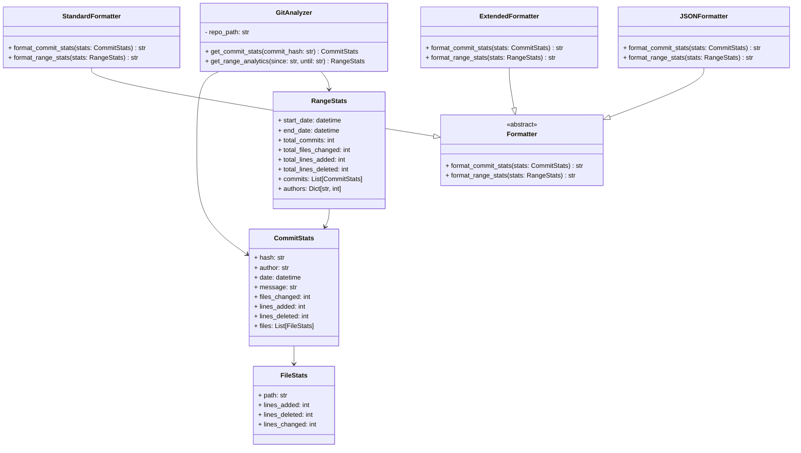

# API Reference

## CLI Command Reference

### `beaconled`
The main command-line interface for Beacon analytics.

**Syntax**:
```bash
beaconled [COMMIT_HASH] [OPTIONS]
```

**Arguments**:
- `COMMIT_HASH`: Optional commit hash to analyze (default: HEAD)

**Options**:
| Option | Description | Default |
|--------|-------------|---------|
| `-f`, `--format FORMAT` | Output format (`standard`, `extended`, `json`) | `standard` |
| `-r`, `--range` | Analyze range of commits | |
| `--since SINCE` | Start date for range analysis | `1 week ago` |
| `--until UNTIL` | End date for range analysis | `HEAD` |
| `--repo PATH` | Repository path to analyze | `.` (current directory) |
| `-h`, `--help` | Show help message | |

**Examples**:
```bash
# Analyze HEAD commit
beaconled

# Analyze specific commit in JSON format
beaconled abc123 --format json

# Analyze last month's commits
beaconled --range --since "1 month ago"

# Analyze different repository
beaconled --repo ../other-project --range --since "2025-07-01"
```

## Python API Reference

### `beaconled.core` Package

#### `GitAnalyzer` Class
```python
class GitAnalyzer(repo_path: str = ".")
```
Analyzes git repository statistics.

**Parameters**:
- `repo_path`: Path to git repository (default: current directory)

**Methods**:

##### `get_commit_stats()`
```python
def get_commit_stats(commit_hash: str = "HEAD") -> CommitStats
```
Get statistics for a single commit.

**Parameters**:
- `commit_hash`: Commit hash to analyze (default: HEAD)

**Returns**:
- `CommitStats` object containing commit details

##### `get_range_analytics()`
```python
def get_range_analytics(since: str, until: str = "HEAD") -> RangeStats
```
Get analytics for a range of commits.

**Parameters**:
- `since`: Start date for range analysis
- `until`: End date for range analysis (default: HEAD)

**Returns**:
- `RangeStats` object containing range analytics

---

### Data Models

#### `CommitStats` Class
```python
class CommitStats:
    hash: str
    author: str
    date: datetime
    message: str
    files_changed: int
    lines_added: int
    lines_deleted: int
    files: List[FileStats]
```
Represents statistics for a single commit.

#### `FileStats` Class
```python
class FileStats:
    path: str
    lines_added: int
    lines_deleted: int
    lines_changed: int
```
Represents file change statistics within a commit.

#### `RangeStats` Class
```python
class RangeStats:
    start_date: datetime
    end_date: datetime
    total_commits: int
    total_files_changed: int
    total_lines_added: int
    total_lines_deleted: int
    commits: List[CommitStats]
    authors: Dict[str, int]
```
Represents analytics for a range of commits.

---

### Formatters

#### `Formatter` Base Class
```python
class Formatter(ABC):
    @abstractmethod
    def format_commit_stats(self, stats: CommitStats) -> str:
        pass
        
    @abstractmethod
    def format_range_stats(self, stats: RangeStats) -> str:
        pass
```
Base class for all output formatters.

#### `StandardFormatter`
```python
class StandardFormatter(Formatter):
```
Produces human-readable output in compact format.

**Example Output**:
```
📊 Commit: abc12345
👤 Author: John Doe
📅 Date: 2025-07-20 10:30:00
💬 Message: Add new feature

📂 Files changed: 3
➕ Lines added: 45
➖ Lines deleted: 12
```

#### `ExtendedFormatter`
```python
class ExtendedFormatter(Formatter):
```
Produces detailed output with additional metrics.

**Example Output**:
```
📊 Commit: abc12345
👤 Author: John Doe
📅 Date: 2025-07-20 10:30:00
💬 Message: Add new feature

📂 Files changed: 3
➕ Lines added: 45
➖ Lines deleted: 12

File types:
  .py: 2 files (+45 -5)
  .md: 1 file (+0 -7)

Components:
  Core: src/analytics.py (+30 -5)
  Tests: tests/test_analytics.py (+15 -0)
  Docs: README.md (+0 -7)
```

#### `JSONFormatter`
```python
class JSONFormatter(Formatter):
```
Produces machine-readable JSON output.

**Example Output**:
```json
{
  "hash": "abc12345",
  "author": "John Doe",
  "date": "2025-07-20T10:30:00+08:00",
  "message": "Add new feature",
  "files_changed": 3,
  "lines_added": 45,
  "lines_deleted": 12,
  "files": [
    {
      "path": "src/analytics.py",
      "lines_added": 30,
      "lines_deleted": 5
    }
  ]
}
```

## Class Diagram



## Next Steps
- [Usage Guide](usage.md) - Practical examples and workflows
- [Integration Guide](integrations.md) - CI/CD and team workflow integration
- [Analytics Dashboard](ANALYTICS_DASHBOARD.md) - Metric interpretation guide
