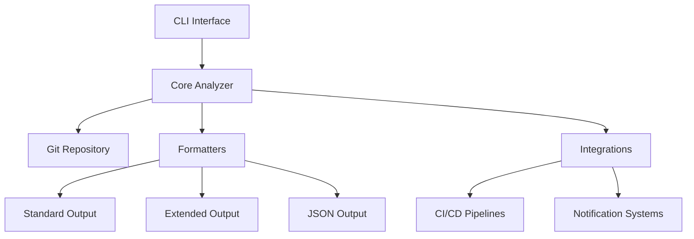

# System Architecture

## Core Components

### CLI Interface (`src/beaconled/cli.py`)
- Entry point for user interactions
- Parses commands and options
- Routes requests to appropriate handlers

### Core Analyzer (`src/beaconled/core/analyzer.py`)
- Processes git history using GitPython
- Calculates commit-level metrics
- Performs impact assessment
- Generates range analyses

### Formatters (`src/beaconled/formatters/`)
- **Standard Formatter**: Human-readable console output
- **Extended Formatter**: Detailed breakdown with additional metrics
- **JSON Formatter**: Machine-readable output for integrations

### Integrations (`src/beaconled/integrations/`)
- CI/CD pipeline hooks
- Notification system adapters
- Data export modules

## Data Flow
1. User executes CLI command
2. CLI parses arguments and initializes analyzer
3. Analyzer fetches git data and computes metrics
4. Results are passed to appropriate formatter
5. Formatted output is returned to user/integrations

## Dependencies
- Zero external dependencies beyond Python standard library
- GitPython for repository access
- Optional: Requests for webhook integrations