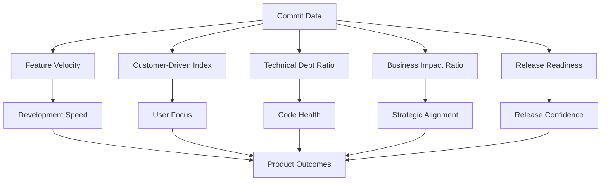

# Product Analytics System

## Overview

This system transforms commit analytics into actionable business intelligence for product-led teams. It provides clear visibility and guidance into the development process, helping teams stay on track and make informed decisions.

## Alignment with "Beacon"

The current implementation of the product analytics system aligns with the core USP of "Beacon" by providing clear visibility and guidance into the development process. Here's how:

*   **Enhanced Visibility:** The system acts as a "beacon," illuminating key aspects of the development process, such as feature velocity, customer focus, and technical debt. This allows the team to see where they are succeeding and where they need to improve.
*   **Data-Driven Guidance:** By providing actionable insights and recommendations, the system guides the team towards making informed decisions that align with product goals. For example, the alert for low customer-driven development prompts the team to conduct user research.
*   **Proactive Monitoring:** The system proactively monitors key metrics and alerts stakeholders when thresholds are breached, ensuring that issues are addressed promptly. This helps the team stay on track and avoid potential problems.
*   **Alignment with Business Goals:** By mapping development activities to business outcomes, the system ensures that the team's efforts are aligned with the overall business strategy. This helps to maximize the impact of development work.
*   **Continuous Improvement:** The system provides a framework for continuous improvement by tracking trends and identifying areas for optimization. This helps the team to become more efficient and effective over time.

In essence, the product analytics system embodies the Beacon Mission by providing the team with the visibility, guidance, and proactive monitoring they need to navigate the development process effectively and achieve their product goals.

## Workflow

Here's how users and teams can integrate Beacon with their workflow:

## Automation

The system can be automated using cron or GitHub Actions. See the `scripts/weekly_report.sh` script and the `.github/workflows/product-analytics.yml` file for examples.

## Configuration

The system can be configured using the following files:

*   `config/notifications.json`: Contains settings for Slack and email notifications.  Set the `SLACK_WEBHOOK_URL`, `EMAIL_USERNAME`, and `EMAIL_PASSWORD` environment variables to enable these features.
*   `config/product_metrics.json`: Contains thresholds and targets for key metrics.

## Key Metrics and Insights

The system provides the following key metrics and insights:

*   **Feature Velocity:** Features delivered per week, indicating development speed.
*   **Customer-Driven Index:** Percentage of commits addressing customer needs, reflecting user focus.
*   **Technical Debt Ratio:** Percentage of commits addressing technical debt, showing code maintainability.
*   **Business Impact Ratio:** Ratio of business-impacting commits to maintenance commits, highlighting strategic alignment.
*   **Release Readiness:** A score (0-100) indicating the preparedness for a release, reflecting overall quality.

These metrics can be used to track progress, identify areas for improvement, and make data-driven decisions.

### Visualization Examples

#### Metric Relationships


#### Dashboard Examples
The metrics can be visualized in various dashboard tools:

**Grafana Example:**
```json
{
  "panels": [
    {
      "title": "Feature Velocity",
      "type": "timeseries",
      "targets": [
        {
          "query": "SELECT mean(\"value\") FROM \"feature_velocity\" WHERE $timeFilter GROUP BY time($interval) fill(null)"
        }
      ]
    },
    {
      "title": "Customer-Driven Index",
      "type": "gauge",
      "targets": [
        {
          "query": "SELECT last(\"value\") FROM \"customer_driven_index\" WHERE $timeFilter"
        }
      ]
    }
  ]
}
```

**Power BI Example:**
```json
{
  "visualizations": [
    {
      "name": "Release Readiness Trend",
      "type": "lineChart",
      "data": "SELECT timestamp, readiness_score FROM release_metrics ORDER BY timestamp"
    },
    {
      "name": "Technical Debt Distribution",
      "type": "pieChart",
      "data": "SELECT component, debt_ratio FROM technical_debt ORDER BY debt_ratio DESC"
    }
  ]
}
```

#### Sample JSON Output
The system can output data in JSON format for easy integration:
```json
{
  "timestamp": "2025-07-23T10:30:00Z",
  "metrics": {
    "feature_velocity": 3.2,
    "customer_driven_index": 67.5,
    "technical_debt_ratio": 23.1,
    "business_impact_ratio": 4.2,
    "release_readiness": 85
  },
  "trends": {
    "feature_velocity_weekly": [2.1, 2.8, 3.2],
    "customer_driven_index_weekly": [58.3, 62.1, 67.5]
  },
  "alerts": [
    {
      "metric": "technical_debt_ratio",
      "value": 23.1,
      "threshold": 20,
      "severity": "warning",
      "recommendation": "Schedule technical debt reduction sprint"
    }
  ]
}
```

#### Integration Examples
**Data Studio Connection:**
```python
import pandas as pd
from scripts.product_analytics import get_product_metrics

# Fetch metrics for Data Studio
metrics_df = pd.DataFrame([get_product_metrics()])
# Connect to Data Studio via Community Connector
```

**ObservableHQ Notebook:**
```javascript
// Import Beacon metrics
const metrics = await fetch('https://api.beacon.example/metrics')
  .then(r => r.json());

// Create interactive visualization
Plot.plot({
  marks: [
    Plot.barY(metrics.trends.feature_velocity_weekly, {fill: "steelblue"}),
    Plot.lineY(metrics.trends.feature_velocity_weekly, {stroke: "black"})
  ]
})
```