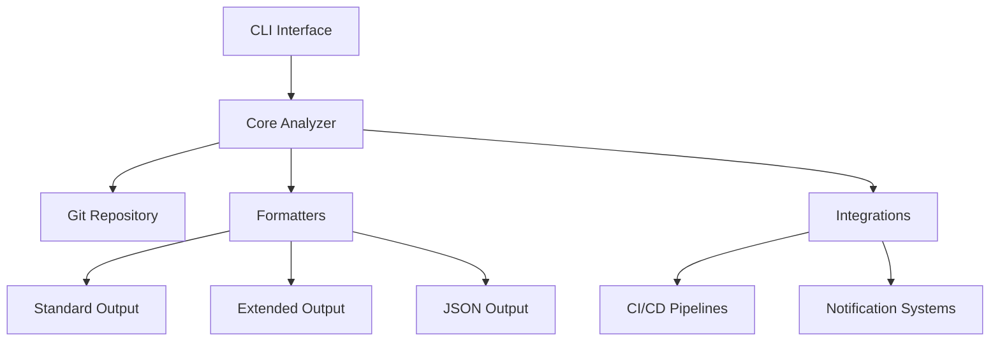

# System Architecture

## Core Components

### CLI Interface (`src/beaconled/cli.py`)
- Entry point for user interactions
- Parses commands and options
- Routes requests to appropriate handlers

### Core Analyzer (`src/beaconled/core/analyzer.py`)
- Processes git history using GitPython
- Calculates commit-level metrics
- Performs impact assessment
- Generates range analyses

### Formatters (`src/beaconled/formatters/`)
- **Standard Formatter**: Human-readable console output
- **Extended Formatter**: Detailed breakdown with additional metrics
- **JSON Formatter**: Machine-readable output for integrations

### Integrations (`src/beaconled/integrations/`)
- CI/CD pipeline hooks
- Notification system adapters
- Data export modules

## Data Flow
1. User executes CLI command
2. CLI parses arguments and initializes analyzer
3. Analyzer fetches git data and computes metrics
4. Results are passed to appropriate formatter
5. Formatted output is returned to user/integrations

## Git Integration

### Migration to GitPython

The system previously used direct subprocess calls to execute git commands. This has been migrated to use the GitPython library for several key benefits:

- **Improved Security**: Eliminates shell command injection risks by using Python-native bindings
- **Better Error Handling**: More granular exception handling for git operations
- **Cross-Platform**: More consistent behavior across different operating systems
- **Maintainability**: Cleaner, more Pythonic code that's easier to test and extend
- **Performance**: Native Python bindings can be more efficient than spawning subprocesses

The migration primarily affected the `core/analyzer.py` module, which now uses GitPython's object model to interact with git repositories.

## Dependencies
- Python 3.7+ standard library
- GitPython (>=3.1.0) - For secure and efficient git repository access
- Optional: Requests (for webhook integrations)
