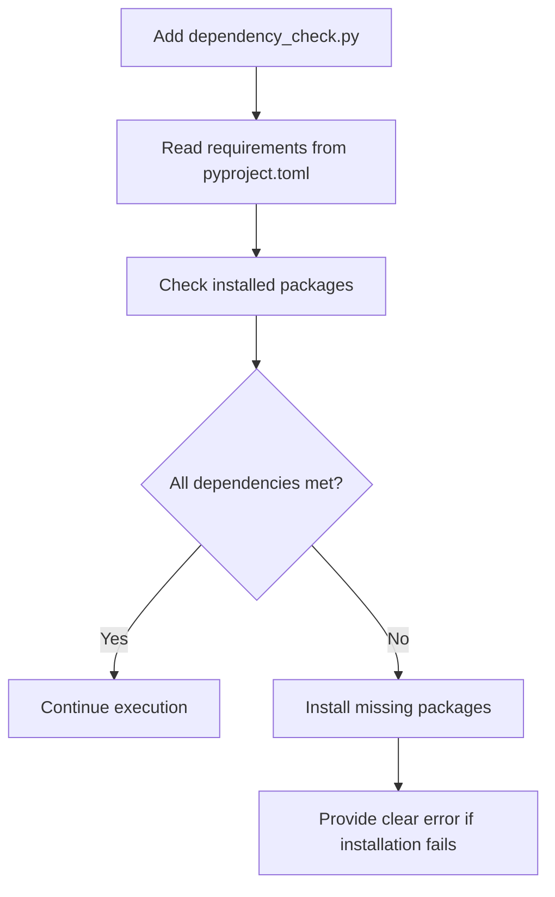
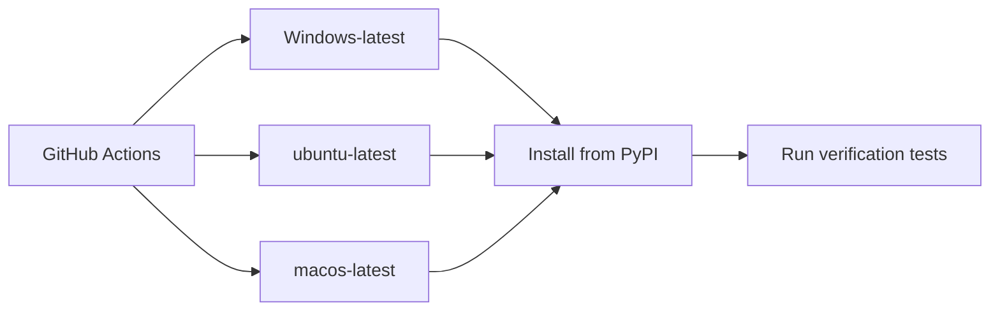
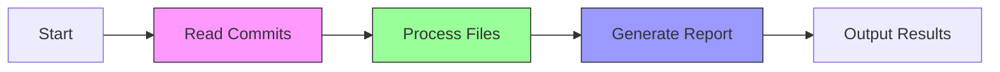
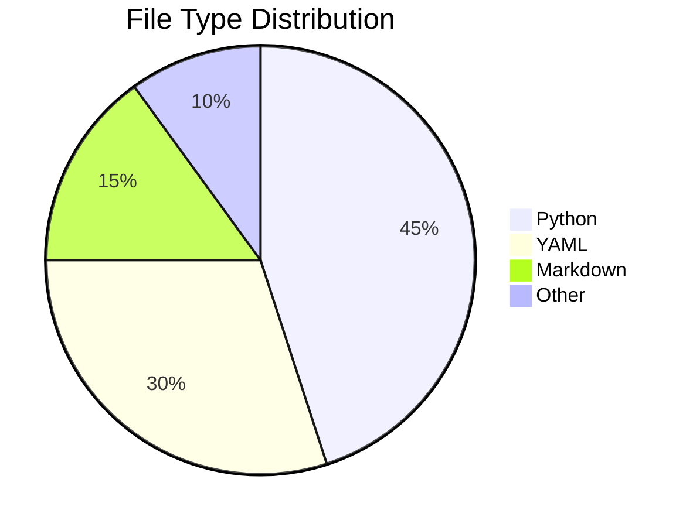

# Dependency Management Improvement Plan

## Problem Statement
During testing, we encountered cases where declared dependencies (like `colorama`) failed to install automatically despite being specified in `pyproject.toml`. This causes runtime errors and poor user experience.

## Proposed Solutions

### 1. Dependency Verification Script
Add an installation verification script that:
- Checks for all required packages
- Validates minimum versions
- Provides clear error messages for missing dependencies

### 2. Documentation Improvements
Update installation docs to:
- Include explicit dependency installation step
- Add troubleshooting section for common issues
- Provide platform-specific guidance

### 3. Clean Environment Testing
Implement automated testing using:
- GitHub Actions matrix testing (Windows, Linux, macOS)
- Python version compatibility checks
- Clean environment validation

### 4. Packaging Enhancements
Investigate and fix the root cause:
- Verify packaging configuration in `pyproject.toml`
- Ensure dependencies are included in wheel metadata
- Test package installation from PyPI test repository

## Implementation Plan

### Phase 1: Dependency Verification


### Phase 2: Documentation Updates
1. Add to `docs/installation.md`:
   ```markdown
   ## Troubleshooting
   
   If you encounter `ModuleNotFoundError` after installation:
   ```bash
   # Manually install dependencies
   pip install -r requirements.txt
   ```
   ```
2. Create `requirements.txt` with pinned dependencies

### Phase 3: Testing Pipeline


### Phase 4: Packaging Fixes
1. Verify wheel contents:
   ```bash
   python -m build
   wheel unpack dist/*.whl
   ```
2. Check METADATA file for correct dependencies
3. Test installation from built wheel

## Verification
- [ ] Dependency checker script works across platforms
- [ ] Documentation updates cover common issues
- [ ] CI pipeline passes on all supported systems
- [ ] Test PyPI installation succeeds in clean environment

## Future Improvements

### Progress Indicators
To address long processing times in large repositories like Home Assistant:

1. **Immediate Solution (v0.2.0)**:
   - Spinner animation during analysis
   - Stage notifications: "Analyzing commits...", "Processing files..."
   - Implemented using Beacon's `rich` dependency

```python
from rich.progress import Progress, SpinnerColumn

with Progress(SpinnerColumn(), "[progress.description]{task.description}") as progress:
    task = progress.add_task("Analyzing repository...", total=None)
    # Analysis happens here
```

2. **Medium-term (v0.3.0)**:
   - Progress bars with estimated time
   - Per-stage tracking:
     - Commit reading
     - File analysis
     - Report generation



3. **Long-term (v0.4.0)**:
   - Parallel processing
   - Performance optimizations
   - Estimated time remaining display

### Output Formatting Enhancements
Based on real-world usage with large repositories:

1. **Intelligent Truncation**:
   - Contributor list limited to top 10 with "and X more" indicator
   - File listings grouped by type after 20 changed files

2. **Visual Enhancements**:
```python
# Before
"Contributors: ... (100+ names)"

# After
"👥 Top Contributors (of 115):"
"  epenet: 81 commits"
"  Erik Montnemery: 72 commits"
"  ..."
"  and 105 others"
```

3. **Insight Generation**:


## Timeline
1. Week 1: Implement dependency verifier and docs update
2. Week 2: Set up CI testing matrix
3. Week 3: Packaging validation and PyPI test upload
4. Week 4: Output formatting improvements
5. Week 5: Final verification and release